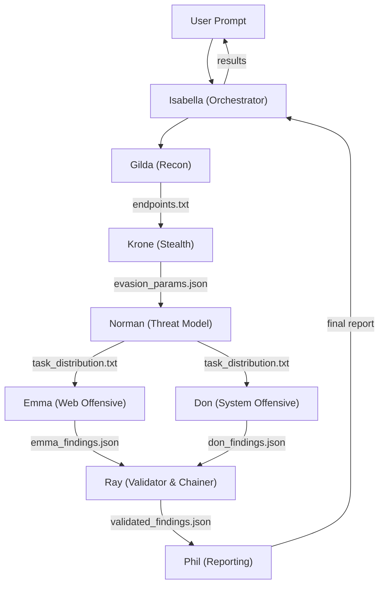

# Noir - Grace Field House Edition  
🚀 Autonomous multi-agent security penetration testing team for [opencode](https://opencode.ai).

[](https://www.python.org)
[](https://dariusbubac.github.io/markdown/)
[](https://git-scm.com)
[]((utility))
[](https://www.docker.com)
[](#license)

---

> **WARNING: DISCLAIMER & ETHICAL GUIDELINES**
>
 Noir is a **fully-autonomous security testing tool** designed for **authorized assessments only**. By using this tool you agree:
>
 - **Authorization required** - Only scan targets you own or have explicit written permission to test. Unauthorized scanning is illegal in most jurisdictions.
 - **Responsible disclosure** - Report discovered vulnerabilities through the vendor's responsible disclosure program.
 - **No malicious use** - Do not use Noir for unauthorized access, data theft, denial of service, or any activity that violates applicable laws.
 - **Zero false positives** - Only validated, reproducible PoCs are flagged.
 - **Scope enforcement** - Noir enforces target-scope rules. URLs outside the target domain are automatically discarded.
 - **Destructive command blocking`** - Commands like `rm -rf`, `dd`, `mkfs`, `chmod 777`, and aggressive DDoS payloads are blocked.

---

## 📢 Architecture (Grace Field House Team)

Noir orchestrates security assessments using a cooperative, multi-agent workflow where each child has a specialized pipeline function:


---

## 📢 Agent Roles

| Agent | Role | Description | Permission |
|--------|--------|--------|--------|
|  **Isabella** | Orchestrator | Coordinates scan pipeline, spawns sub-agents | Edit, Read |
| 📢 **Gilda** | Recon & Scout | Performs port scans, fuzzing, and JS analysis | Bash (nmap/ffuf/curl), Read |
| 📍 **Krone** | Stealth & Evasion | Writes evasion config to bypass WAFs and rate limits | Edit, Read |
| 💓 **Norman** | Threat Model | Analyzes recon data, designs test plan for Emma & Don | Read |
| 📌 **Emma** | Web Offensive | Tests IDOR, CSRF, SSRF, XSS | Bash (curl), Read |
| 🎁 **Don** | System Offensive | Tests SQLi, RCE, LFI, file upload | Bash (curl), Read |
| 💅 **Ray** | Validator & PoC | Writes and executes PoCs, attack chaining | Bash (python3), Edit, Read |
| 🕑 **Phil** | Reporter | Gathers findings, generates interactive HTML report | Edit, Read |

---

## 🖮 Quick Start
```bash
git clone https://github.com/rheatkhs/noir.git
cd noir
opencode

# Isabella will autonomously initiate the scan flow
attack http://localhost:3000
agent isabella "scan http://target.com"
```

---

## 🖗 Configuration

Refer to `opencode.jsonc` for permission settings for each agent.

---

## 📢 License

Dual-licensed under Apache-2.0 or MIT.
