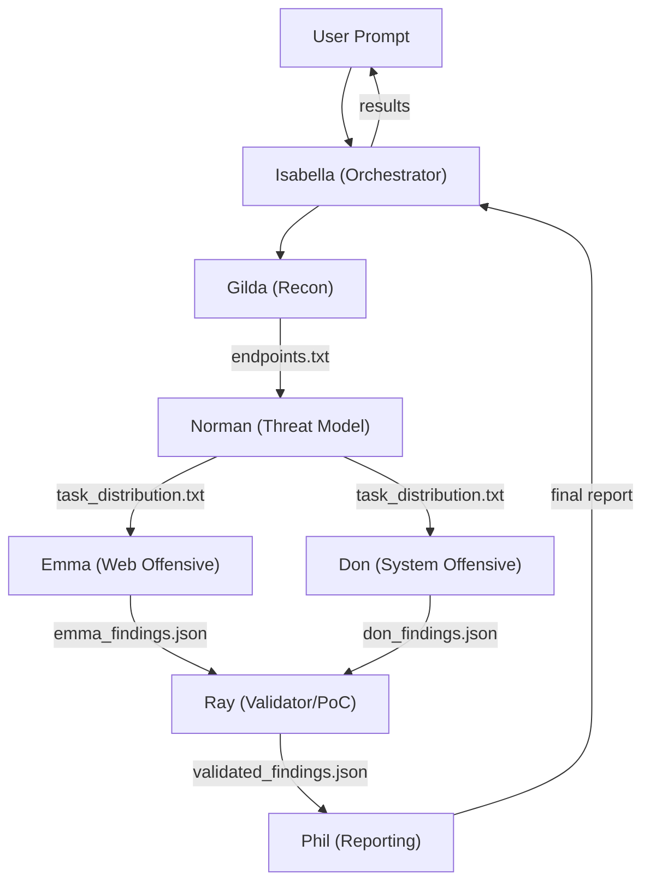

# Noir - Grace Field House Edition

Autonomous multi-agent security penetration testing team for [opencode](https://opencode.ai).  
251 skill playbooks  | 7 specialized agents  | 10 engagement modes  | Findings DB

$[ opencode ](https://opencode.ai) $[ skills: 251 ](.opencode/skills) $[ license: Apache-2.0 | MIT ](#license)

---

> **⚠ DISCLAIMER & ETHICAL GUIDELINES**
>
> Noir is a **security testing tool** designed for **authorized assessments only**. By using this tool you agree:
>
> - **Authorization required** - Only scan targets you own or have explicit written permission to test. Unauthorized scanning is illegal in most jurisdictions.
> - **Responsible disclosure** - Report discovered vulnerabilities through the vendor's responsible disclosure program. Do not publicly disclose unpatched vulnerabilities.
> - **No malicious use** - Do not use Noir for unauthorized access, data theft, denial of service, or any activity that violates applicable laws.
> - **Zero false positives** - Only validated, reproducible PoCs are flagged. Every finding includes a working exploit script and CVSS 4.0 score.
> - **Scope enforcement** - Noir enforces target-scope rules at every phase. URLs outside the target domain are automatically discarded.
> - **Destructive command blocking** - Commands like `rm -rf`, `dd`, `mkfs`, `chmod 777`, and aggressive DDoS payloads are blocked at the agent permission layer.
>
> **Violating these guidelines may result in criminal charges, civil liability, and account suspension from your cloud/service provider. You — not the authors — bear full responsibility for your actions.**

---

## Architecture (Grace Field House Team)

Noir orchestrates security assessments using a cooperative, multi-agent workflow where each child has a specialized pipeline function:



---

## Agent Roles

| Agent | Role | Description | Permission |
|--------|--------|--------|--------|
| **Isabella** | Orchestrator | Coordinates scan pipeline, spawns sub-agents | Edit, Read |
| **Gilda** | Recon & Scout | Performs port scans, fuzzing, and JS analysis | Bash (nmap/ffuf/curl), Read |
| **Norman** | Threat Model | Analyzes recon data, designs test plan for Emma & Don | Read |
| **Emma** | Web Offensive | Tests IDOR, CSRF, SSRF, XSS | Bash (curl), Read |
| **Don** | System Offensive | Tests SQLi, RCE, LFI, file upload | Bash (curl), Read |
| **Ray** | Validator & PoC | Writes and executes PoCs, attack chaining | Bash (python3), Edit, Read |
| **Phil** | Reporter | Gathers findings, generates markdown report | Edit, Read |

---

## Quick Start

```bash
git clone https://github.com/rheatkhs/noir.git
cd noir
opencode

# Isabella will initiate the scan and delegate all tasks autonomously
attack http://localhost:3000
agent isabella "scan http://target.com"
```

---

## Project Structure

```
.github/workflows/       # CI (skill validation + MCP smoke test)
.opencode/
  agents/    isabella.md          # Orchestrator definition
    gilda.md             # Recon definition
    norman.md            # Threat Model definition
    emma.md              # Offensive Web definition
    don.md               # Offensive System definition
    ray.md               # Validator definition
    phil.md               # Reporter definition
  commands/scan.md       # Guided scan command + mode detection
  skills/                # 251 skill playbooks (vulns, CTF, framework, proto, etc)
scripts/                 # Dev/test scripts
tools/
  db.py                 # SQLite findings database
  auth.py               # Auth session manager
  queue.py              # Multi-target scan queue
  chainer.py             # Attack chaining engine
  recon_server.py       # MCP server (FastMCP)
  browser_scanner.py    # Playwright DOM / cookie / CSP scanner
opencode.jsonc           # Agent + skill + MCP config
Dockerfile               # Container sandbox
```M

---

## Configuration

Refer to `opencode.jsonc` for permission settings for each agent.

---

## License

Dual-licensed under Apache-2.0 or MIT.
