# Noir

Autonomous security penetration testing agent for [opencode](https://opencode.ai).  
251 skill playbooks · 10 engagement modes · Findings database · MCP server · CVSS scoring · Remediation patterns

[](https://opencode.ai)
[](.opencode/skills)
[](https://github.com/rheatkhs/noir/releases)
[](#license)

---

> **⚠ DISCLAIMER & ETHICAL GUIDELINES**
>
> Noir is a **security testing tool** designed for **authorized assessments only**. By using this tool you agree:
>
> - **Authorization required** — Only scan targets you own or have explicit written permission to test. Unauthorized scanning is illegal in most jurisdictions.
> - **Responsible disclosure** — Report discovered vulnerabilities through the vendor's responsible disclosure program. Do not publicly disclose unpatched vulnerabilities.
> - **No malicious use** — Do not use Noir for unauthorized access, data theft, denial of service, or any activity that violates applicable laws.
> - **Zero false positives** — Only validated, reproducible PoCs are flagged. Every finding includes a working exploit script and CVSS 4.0 score.
> - **Scope enforcement** — Noir enforces target-scope rules at every phase. URLs outside the target domain are automatically discarded.
> - **Destructive command blocking** — Commands like `rm -rf`, `dd`, `mkfs`, `chmod 777`, and aggressive DDoS payloads are blocked at the agent permission layer.
>
> **Violating these guidelines may result in criminal charges, civil liability, and account suspension from your cloud/service provider. You — not the authors — bear full responsibility for your actions.**


## Architecture

```mermaid
flowchart TB
    CLI["opencode CLI"]

    subgraph Agent["Noir Agent (.opencode/agents/noir.md)"]
        AGENT["Agent Kernel"] --> MODES["Mode Detector"]
        MODES --> SCOPE["Scope Enforcer"]
        SCOPE --> SKILLS["Skill Router · 251 playbooks"]
    end

    subgraph Pipeline["Attack Pipeline"]
        PC1["① Recon → ② JS Analysis → ③ Cache"] --> PC2["④ Vuln Scan (8 types)<br/>SQLi XSS LFI SSRF IDOR RCE SSTI redirect"]
        PC2 --> PC3["⑤ PoC Validation → ⑥ CVSS 4.0 → ⑦ Remediation"]
        PC3 --> PC4["⑧ Persist (findings.db) → ⑨ Report"]
    end

    subgraph MCP["Recon MCP Server (tools/recon_server.py)"]
        MCP_TOOLS["nmap_scan · http_probe · dns_lookup · whois_lookup · ffuf_fuzz · ssl_check · cve_search · subdomain_enum"]
    end

    subgraph Sandbox["Docker Sandbox (Dockerfile)"]
        DOCKER["python:3.11-slim + nmap + curl + ffuf + playwright"]
    end

    CLI --> AGENT
    SKILLS --> PC1
    PC1 <--> MCP_TOOLS
    PC4 -.->|writes to| DOCKER

    style Sandbox fill:#1a1a2e,stroke:#e94560,stroke-width:2px
    style Pipeline fill:#16213e,stroke:#0f3460,stroke-width:1px
    style MCP fill:#0f3460,stroke:#533483,stroke-width:1px
    style Agent fill:#533483,stroke:#e94560,stroke-width:2px
```



---

## Quick Start

```bash
git clone https://github.com/rheatkhs/noir.git
cd noir
opencode

attack http://localhost:3000
scan http://target.com in ctf mode
```

### Requirements

| Tool | Purpose |
|------|---------|
| [opencode](https://opencode.ai) | Agentic CLI runtime |
| `nmap`, `curl`, `ffuf`, `python3` | Scanning, requests, fuzzing, scripting |

Or use the Docker sandbox:

```bash
docker build -t noir .
docker run -it --rm -v "$(pwd):/workspace" noir
```

---

## Key Features

| Feature | Description |
|---------|-------------|
| **Attack pipeline** | Fully autonomous 9-step chain: recon → fuzz → JS analysis → vuln scan (8 types) → PoC validation → CVSS scoring → remediation → DB persist → report |
| **Findings database** | SQLite persistence at `~/.noir/findings.db`. Query, filter, summarize across sessions |
| **Differential re-scan** | Caches response hashes per endpoint. Skips unchanged endpoints on repeat scans. 10x faster |
| **CVSS 4.0 scoring** | Quantitative severity vectors and scores for every validated finding |
| **Remediation patterns** | BAD/GOOD code fixes for SQLi, XSS, LFI, SSRF, deserialization, prototype pollution, command injection |
| **Recon MCP server** | Standalone server wrapping nmap, curl, dig, whois, ffuf as callable tools |
| **10 engagement modes** | Auto-detected modes optimizing tool priority, workflow, and output format |
| **251 skill playbooks** | Vulnerability classes, CTF, frameworks, protocols, post-exploitation, payloads, forensics, mobile, IoT, AD/red team |
| **Auth manager** | Persist sessions (basic, form, bearer). Authenticated requests through cookie jar |
| **Multi-target queue** | Add targets, schedule recurring scans (hourly/daily), batch process |
| **Attack chaining** | Auto-escalate findings: LFI→RCE, SSRF→cloud creds, SQLi→xp_cmdshell, IDOR→privilege escalation |

---

## Commands

| Command | Description |
|---------|-------------|
| `attack <url>` | Full autonomous pipeline (recon → exploit → validate → report) |
| `scan <url>` | Guided multi-phase scan with mode detection |

---

## Engagement Modes

| Mode | Use Case | Priority | Output |
|------|----------|----------|--------|
| `auto` | Unknown target | Adaptive | Standard |
| `bug-bounty` | HackerOne, Bugcrowd, Intigriti | Recon > Enum > Exploit | HackerOne format |
| `red-team` | Stealth ops, AD, persistence | Recon > Exploit > Enum | Executive summary |
| `ctf` | HackTheBox, TryHackMe, picoCTF | Exploit > Enum > Recon | Flag submission |
| `blue-team` | Detection, IR, defense | Enum > Recon > Report | IR report |
| `offensive` | Aggressive exploitation | Exploit > Enum > Recon | Technical |
| `grey-hat` | Balanced assessment | Balanced | Technical |
| `forensic` | Evidence preservation | Forensics > Report | Chain-of-custody |
| `reverse-engineering` | Binaries, firmware, malware | RE > Exploit > Utility | Technical RE |
| `mobile-pentest` | Android / iOS assessment | Mobile > Enum > Exploit | OWASP Mobile Top 10 |

---

## Findings Database

Every validated vulnerability is persisted to `~/.noir/findings.db` with target, type, CVSS score, PoC, evidence, and status.

```bash
# Summary per target
python tools/db.py summary

# Query all open findings
python tools/db.py query "SELECT * FROM findings WHERE status='open'"

# Close a finding
python tools/db.py update 1 fixed
```

---

## Recon MCP Server

Registered in `opencode.jsonc` — auto-loaded on project open. Each tool has built-in caching, timeouts, and structured output.

| Tool | What it does | Cache TTL |
|------|-------------|-----------|
| `nmap_scan` | Port scan target host | 5 min |
| `http_probe` | Fetch HTTP headers / page content | 30 s |
| `dns_lookup` | DNS record lookup | 1 min |
| `whois_lookup` | WHOIS domain/IP lookup | 10 min |
| `ffuf_fuzz` | Directory fuzzing with custom wordlist | 5 min |
| `ssl_check` | SSL/TLS certificate & cipher audit | 10 min |
| `cve_search` | CVE lookup by product + version | 1 hour |
| `subdomain_enum` | crt.sh / certspotter subdomain discovery | 5 min |

---

## Project Structure

```
.github/workflows/       # CI (skill validation + MCP smoke test)
.opencode/
  agents/noir.md         # Agent definition + operating principles
  commands/attack.md     # Autonomous attack pipeline (9 phases)
  commands/scan.md       # Guided scan command + mode detection
  skills/                # 251 skill playbooks (vulns, CTF, framework, proto, etc)
scripts/                 # Dev/test scripts
tools/
  db.py                 # SQLite findings database
  auth.py               # Auth session manager (basic, form, bearer, cookie jar)
  queue.py              # Multi-target scan queue (schedule, batch, results)
  chainer.py            # Attack chaining engine (LFI→RCE, SSRF→meta, SQLi→shell)
  recon_server.py       # MCP server (FastMCP)
  browser_scanner.py    # Playwright DOM / cookie / CSP scanner
opencode.jsonc           # Agent + skill + MCP config
Dockerfile               # Container sandbox (python:3.11-slim + nmap + ffuf)
```

---

## Configuration

```jsonc
{
  "$schema": "https://opencode.ai/config.json",
  "default_agent": "noir",
  "agent": {
    "noir": {
      "description": "Autonomous security penetration testing agent",
      "mode": "primary",
      "permission": {
        "bash": { "nmap *": "allow", "curl *": "allow", "*": "ask" },
        "edit": "deny",
        "read": "allow"
      }
    }
  },
  "mcp": {
    "noir-recon": {
      "type": "local",
      "command": ["python", "tools/recon_server.py"],
      "enabled": true
    }
  }
}
```

No model pinned, no API key required. Set `ROUTER_API_KEY` or `OPENAI_API_KEY` to use a custom LLM.

---

## License

Dual-licensed under Apache-2.0 or MIT.
